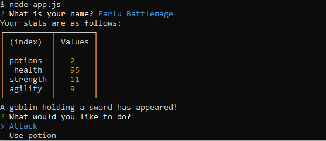
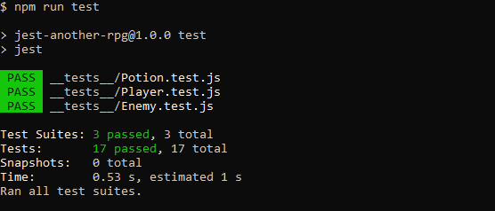
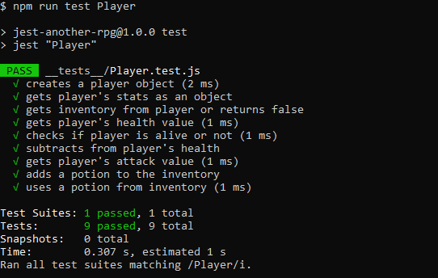
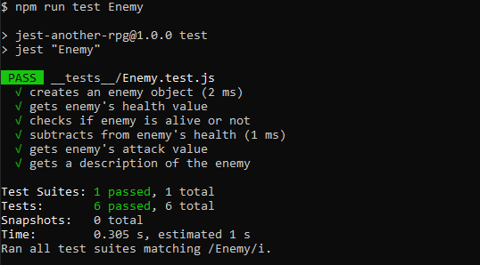
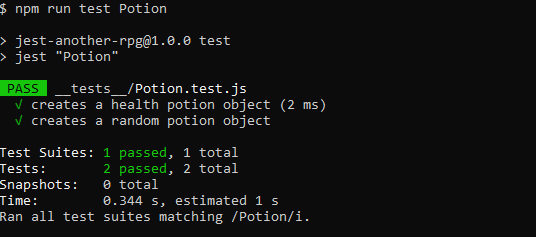

# Jest Another RPG

A command line RPG in which users can input their name, battle different enemies with different stats, and utilize random potion drops.

## Table of Contents
- [Getting Started](#getting-started)
- [Usage](#usage)
- [Testing](#testing)
- [Object-Oriented Programming](#object-oriented-programming)
- [Technologies](#technologies)
- [Contributing](#contributing)
- [License](#license)

## Getting Started

These instructions will get you a copy of the project up and running on your local machine for development and testing purposes. See deployment for notes on how to deploy the project on a live system.

### Prerequisites

Download and install the following in order to install the run this project:
- [Node.js](https://nodejs.dev/learn/how-to-install-nodejs)

### Installation

To get a development environment running:

1. Clone this repository onto your machine.
2. Navigate to the root of this repo in the command line and run `npm install`.
3. You are all set!

## Usage
To run the app and play the RPG, run `node app.js` from the root directory on the command line.

- Answer the prompts with a name and choose which action you would like to take on each encounter.
- Keep track of your stats to help you make the best choices!

To quit, type `Ctrl + C`.

## Testing
- To run all tests, run `npm run test` from the root directory of the project in the command line:

### Player Tests
The Player tests check if the Player object has been successfully created with all of its associated methods.

- To run tests for the Player object, run `npm run test Player`:

### Enemy Tests
The Enemy tests check if the Enemy object has been successfully created with all of its associated methods.

- To run tests for the Enemy object, run `npm run test Enemy`:

### Potion Tests
The Potion tests check if the Potion object has been successfully created with all of its associated methods.

- To run tests for the Potion object, run `npm run test Potion`:

### Additional Tests
Additional tests can be created in the `__tests__` folder.

## Object Oriented Programming
This app uses Object Oriented Programming (OOP) to create and use instances of objects. The code for the objects are found in the `lib/` folder.

### Objects
- Character
    - Attributes: `name`, `health`, `agility`, `strength`
    - Methods:
        * `isAlive()`: Checks if character health is above 0.
        * `getHealth()`: Prints the character's health.
        * `getAttackValue()`: Generates an attack value using the character's `strength`.
        * `reduceHealth()`: Deducts the character's health after being attacked.

- Player (extends the Character class)
    - Attributes: Same as Character attributes with the addition of `inventory`.
    - Methods (Same as Character methods with the addition of the following):
        * `getStats()`: Returns the Player's `health`, `strength`, `agility`, and `potions`.
        * `getInventory()`: Returns the Player's inventory or returns false if there is nothing in the inventory.
        * `addPotion()`: Pushes a potion into the Player's inventory array.
        * `usePotion()`: Updates the Player's stats depending on the type of `Potion` the user chooses.

- Enemy (extends the Character class)
    - Attributes: Same as Character attributes with the addition of `weapon` and `potion`.
    - Methods (Same as Character methods with the addition of the following):
        * `getDescription()`: Prints a description of the Enemy.

- Potion
    - Attributes:
        * `types`: Array of `health`, `agility`, and `strength` potion types.
        * `name`: Randomly chosen from the `types` array.

## Technologies

* [Node.js](https://nodejs.org/en/docs/) - JavaScript runtime environment to run the game in the terminal.
* [Jest](https://jestjs.io/) - Testing framework for Player, Enemy, and Potion objects.

## Contributing

If you would like to contribute to this project, you can reach out to me by [email](mailto:ksurbayan@gmail.com)!

## License

This project is licensed under the MIT License - see the [LICENSE](LICENSE) file for details.
